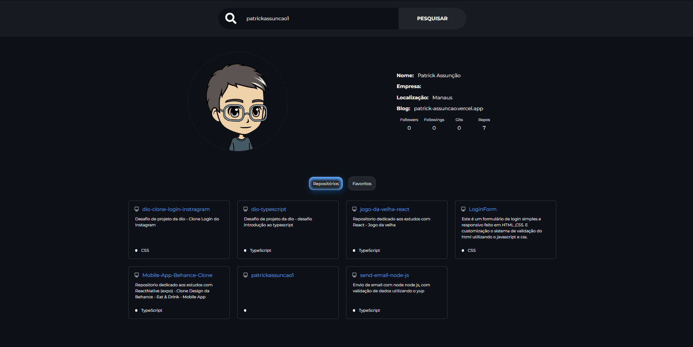

# GitHub Api Interface  
    Desafio de Projeto da Dio : Consumindo API do GitHub para buscas de users.

## Preview

### `npm start`
Executa o aplicativo no modo de desenvolvimento.\
Abra [http://localhost:3000](http://localhost:3000) para visualizá-lo no navegador.

### `npm test`
Inicia o executor de teste no modo de exibição interativa.

